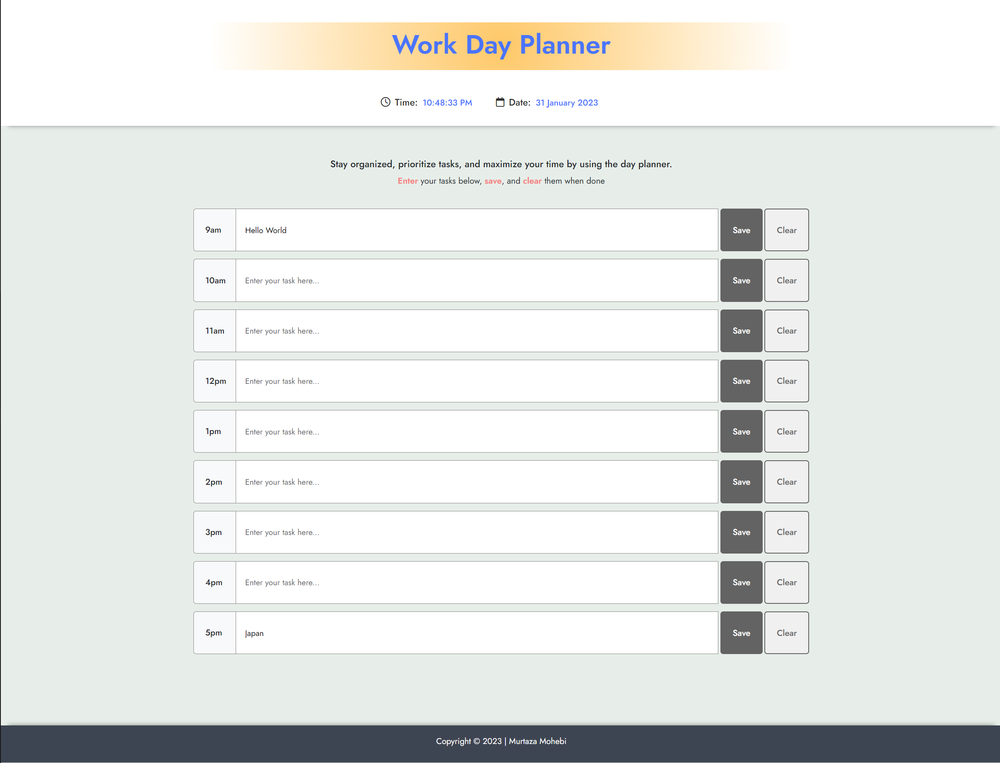

# Work Day Scheduler

This project is a tool designed to help individuals manage their daily tasks and responsibilities in a more organized and efficient manner. This planner is ideal for busy professionals who are constantly juggling multiple tasks and need a way to keep track of their tasks, to-do lists, and other important deadlines. The planner is easy to use with its sleek design, and user-friendly interface.

Aside from its user-friendly design, this day planner uses [Moment.js](https://momentjs.com/) to accurately manage time and date.

Using the **Local Storage** feature of the user's browser, I have stored the users data locally. This means that users can still access their tasks after closing and reopening their browsers.

#### The application will include the following:

- Display current time and date 
- Show working hours from 9am to 5pm
- Input field (where users can enter their tasks)
- Save button (To store user input locally)
- clear button (To remove user data from local storage)

### View Project / Code

To view project, visit [Work Day Planner](https://murtaza34.github.io/Work-Day-Planner/).

## Preview

